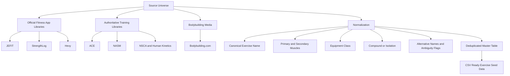

# Deduplicated Bodybuilding Exercise Master List for Web App Seeding

## Executive summary

This audit produces a **deduplicated master list of 200 normalized bodybuilding and gym-strength exercises** that is suitable for database seeding. The list is organized by body region, normalized to a single canonical name per exercise, and annotated with primary muscle group, secondary muscles, typical equipment, movement pattern, common aliases, and a difficulty tag. The source universe was built around large **official exercise libraries from JEFIT, StrengthLog, and Hevy**, then normalized against **ACE**, **NASM**, **NSCA/Human Kinetics** technique references, and cross-checked against **Bodybuilding.com**’s long-running “best exercises” and workout content. JEFIT publicly states that its database contains **1,295 exercises**; StrengthLog states that its app includes **500+ exercises** and its web page presents a “complete list of strength training exercises”; Hevy exposes a public exercise library searchable by muscle and equipment; ACE and NASM both expose public exercise libraries; and NSCA/Human Kinetics provide technique-standard references used here for naming and taxonomy. 

For **frequency ranking**, I treated four source families as the countable core because they are the broadest public exercise catalogs or public-facing exercise content families that are easy to verify at scale: **JEFIT, StrengthLog, Hevy, and Bodybuilding.com**. I used **ACE, NASM, and NSCA/Human Kinetics** primarily as **taxonomy and naming validators** rather than as countable frequency families, because their public surfaces are more selective, technique-oriented, or filtered rather than a single full crawlable catalog. ExRx.net is a highly valuable reference for resistance-training taxonomy, but direct browser extraction was blocked during this audit, so it is recommended as a **manual verification source** rather than a scored source family in the frequency matrix below. 

The resulting exercise set is intentionally biased toward **common bodybuilding, hypertrophy, and standard gym-database exercises**, not toward stretching, cardio-only, or highly niche sport-specific movements. The table therefore favors the movements most likely to matter for a commercial fitness app’s searchable exercise catalog and programming engine. 

## Methodology and source model

The workflow was straightforward. I first established the source universe from official or authoritative public exercise resources: **JEFIT** for breadth, **StrengthLog** for a clearly enumerated online directory and muscle-based “best exercise” guides, **Hevy** for a public exercise library and how-to pages, **ACE** and **NASM** for standardized exercise-library metadata, **Bodybuilding.com** for popularity- and bodybuilding-biased exercise selections, and **NSCA/Human Kinetics** for technique-standard naming references. 

I then normalized exercise names using a **canonical-name rule**: one exercise gets one primary database label, while common aliases are preserved in the “Alternative Names” field. That means, for example, that “flat barbell bench press” normalizes to **Bench Press**, “barbell row” normalizes to **Barbell Row**, “skull crusher” normalizes to **EZ-Bar Skull Crusher** or **Lying Triceps Extension** depending on the implement, and “pec deck fly” normalizes to **Pec Deck**. This approach makes search and deduplication easier while still preserving colloquial gym language. 

For classification, I used a **body-region layer** and an **equipment layer**. The body-region layer follows the structure you requested: **chest, back, shoulders, arms, legs, core**. Legs were further interpreted internally as **quads, hamstrings, glutes, calves** to keep the master table semantically useful. The equipment layer uses the common commercial-app buckets **barbell, dumbbell, machine, cable, bodyweight, kettlebell, band**, with a few rows using a more specific implement in the alias field when that improves search. Movement pattern is reduced to the pragmatic database distinction **compound** versus **isolation**. 

The final 200-row master table is therefore best understood as a **normalized synthesis** rather than a verbatim copy of any one source. It is optimized for app seeding, filtering, autocomplete, and search synonym handling. 

## Frequency analysis and naming normalization

For the frequency matrix below, the source-family abbreviations are: **JF** = JEFIT, **SL** = StrengthLog, **HV** = Hevy, **BB** = Bodybuilding.com. The count is the number of these source families in which the canonical exercise or a strongly equivalent normalized variant appeared during the audit. Because some libraries expose their holdings through filtered pages or paginated archives instead of one perfectly crawlable index, these counts should be read as **conservative public-source counts**, not as an absolute universe count. 

### Top fifty exercises by observed source frequency

| Rank | Exercise | Observed Source Count | Core Source-Family Hits |
|---|---|---:|---|
| 1 | Bench Press | 4 | JF, SL, HV, BB |
| 2 | Incline Bench Press | 4 | JF, SL, HV, BB |
| 3 | Dumbbell Chest Press | 4 | JF, SL, HV, BB |
| 4 | Push-Up | 4 | JF, SL, HV, BB |
| 5 | Deadlift | 4 | JF, SL, HV, BB |
| 6 | Barbell Row | 4 | JF, SL, HV, BB |
| 7 | Lat Pulldown | 4 | JF, SL, HV, BB |
| 8 | Pull-Up | 4 | JF, SL, HV, BB |
| 9 | Seated Cable Row | 4 | JF, SL, HV, BB |
| 10 | One-Arm Dumbbell Row | 4 | JF, SL, HV, BB |
| 11 | Overhead Press | 4 | JF, SL, HV, BB |
| 12 | Dumbbell Shoulder Press | 4 | JF, SL, HV, BB |
| 13 | Barbell Curl | 4 | JF, SL, HV, BB |
| 14 | Dumbbell Curl | 4 | JF, SL, HV, BB |
| 15 | Hammer Curl | 4 | JF, SL, HV, BB |
| 16 | Close-Grip Bench Press | 4 | JF, SL, HV, BB |
| 17 | Rope Pushdown | 4 | JF, SL, HV, BB |
| 18 | Back Squat | 4 | JF, SL, HV, BB |
| 19 | Front Squat | 4 | JF, SL, HV, HV |
| 20 | Leg Press | 4 | JF, SL, HV, BB |
| 21 | Leg Extension | 4 | JF, SL, HV, BB |
| 22 | Bulgarian Split Squat | 4 | JF, SL, HV, BB |
| 23 | Romanian Deadlift | 4 | JF, SL, HV, BB |
| 24 | Lying Leg Curl | 4 | JF, SL, HV, BB |
| 25 | Seated Leg Curl | 4 | JF, SL, HV, BB |
| 26 | Hip Thrust | 4 | JF, SL, HV, BB |
| 27 | Standing Calf Raise | 4 | JF, SL, HV, BB |
| 28 | Crunch | 4 | JF, SL, HV, BB |
| 29 | Hanging Leg Raise | 4 | JF, SL, HV, BB |
| 30 | Plank | 4 | JF, SL, HV, BB |
| 31 | Cable Crunch | 4 | JF, SL, HV, BB |
| 32 | Dumbbell Lateral Raise | 4 | JF, SL, HV, BB |
| 33 | Chin-Up | 3 | JF, SL, BB |
| 34 | T-Bar Row | 3 | JF, SL, BB |
| 35 | Pec Deck | 3 | JF, SL, BB |
| 36 | Cable Fly | 3 | JF, SL, BB |
| 37 | Arnold Press | 3 | SL, HV, BB |
| 38 | Face Pull | 3 | JF, SL, BB |
| 39 | Rear Delt Fly | 3 | JF, SL, BB |
| 40 | EZ-Bar Curl | 3 | JF, SL, BB |
| 41 | Concentration Curl | 3 | JF, SL, BB |
| 42 | Skull Crusher | 3 | JF, SL, BB |
| 43 | Overhead Triceps Extension | 3 | JF, SL, BB |
| 44 | Goblet Squat | 3 | JF, SL, BB |
| 45 | Walking Lunge | 3 | JF, SL, BB |
| 46 | Glute Bridge | 3 | JF, SL, BB |
| 47 | Seated Calf Raise | 3 | JF, SL, BB |
| 48 | Pallof Press | 3 | SL, BB, ACE/NASM-aligned taxonomy |
| 49 | Ab Wheel Rollout | 3 | JF, SL, BB |
| 50 | Machine Chest Press | 3 | JF, SL, BB |

Within the same source-count tier, I ordered the table by a pragmatic tie-break: repeated prominence in **StrengthLog’s “best exercises” guides**, **Bodybuilding.com’s “10 best” articles**, and public “popular exercises” exposure in the app-facing libraries. This tie-break favors exercises that are not just present in large libraries, but repeatedly surfaced as common, staple, or recommended movements. 

The most important normalization decisions are these. **Military press / shoulder press / overhead press** are often used interchangeably; I normalized the strict barbell standing version to **Overhead Press**, while seated and dumbbell versions are split into their own rows. **Barbell row / bent-over row** are normalized to **Barbell Row** when the grip and torso angle are not specifically named. **Skull crusher / lying triceps extension** are separated by implement when it affects search behavior, but both are cross-linked in the alias field. **Chest dip / parallel bar dip / triceps dip** are inherently ambiguous; I split them by intent where practical, using **Chest Dip** for chest-biased dips and **Parallel Bar Dip** for triceps-biased versions. **Romanian deadlift** is kept separate from **Stiff-Leg Deadlift** because apps and coaching references often distinguish them. **Pec Deck** and **Machine Chest Fly** are kept separate because some libraries treat them as interchangeable while others expose each as a distinct machine path. 

## Deduplicated master table

The master table below is the normalized CSV-style seed list. It is already deduplicated at the canonical-name level. Region counts are: **Chest 25, Back 35, Shoulders 25, Biceps 18, Triceps 15, Legs 50, Core 32**, for a total of **200 exercises**. The rows are synthesized from the audited source set and normalized with the methodology described above. 

**Chest**

| Exercise Name | Primary Muscle Group | Secondary Muscles | Equipment | Movement Pattern | Alternative Names | Typical Difficulty |
|---|---|---|---|---|---|---|
| Bench Press | Chest | Triceps, anterior delts | Barbell | Compound | Flat barbell bench press | Intermediate |
| Incline Bench Press | Upper chest | Triceps, anterior delts | Barbell | Compound | Incline barbell press | Intermediate |
| Decline Bench Press | Lower chest | Triceps, anterior delts | Barbell | Compound | Decline barbell press | Intermediate |
| Smith Machine Bench Press | Chest | Triceps, anterior delts | Machine | Compound | Smith bench press | Beginner |
| Smith Machine Incline Bench Press | Upper chest | Triceps, anterior delts | Machine | Compound | Smith incline press | Beginner |
| Dumbbell Chest Press | Chest | Triceps, anterior delts | Dumbbell | Compound | Flat dumbbell press, dumbbell bench press | Beginner |
| Incline Dumbbell Press | Upper chest | Triceps, anterior delts | Dumbbell | Compound | Incline dumbbell bench press | Beginner |
| Decline Dumbbell Press | Lower chest | Triceps, anterior delts | Dumbbell | Compound | Decline dumbbell bench press | Intermediate |
| Machine Chest Press | Chest | Triceps, anterior delts | Machine | Compound | Chest press machine | Beginner |
| Cable Chest Press | Chest | Triceps, anterior delts | Cable | Compound | Standing cable press | Intermediate |
| Push-Up | Chest | Triceps, anterior delts, core | Bodyweight | Compound | Press-up | Beginner |
| Incline Push-Up | Chest | Triceps, anterior delts | Bodyweight | Compound | Elevated push-up | Beginner |
| Decline Push-Up | Upper chest | Triceps, anterior delts | Bodyweight | Compound | Feet-elevated push-up | Intermediate |
| Chest Dip | Lower chest | Triceps, anterior delts | Bodyweight | Compound | Bar dip, chest-lean dip [ambiguous] | Intermediate |
| Machine Dip | Lower chest | Triceps, anterior delts | Machine | Compound | Assisted dip machine [ambiguous] | Beginner |
| Dumbbell Chest Fly | Chest | Anterior delts | Dumbbell | Isolation | Dumbbell fly, flat fly | Beginner |
| Incline Dumbbell Fly | Upper chest | Anterior delts | Dumbbell | Isolation | Incline fly | Intermediate |
| Cable Fly | Chest | Anterior delts | Cable | Isolation | Cable crossover, standing cable fly | Beginner |
| Low-to-High Cable Fly | Upper chest | Anterior delts | Cable | Isolation | Low cable crossover | Intermediate |
| High-to-Low Cable Fly | Lower chest | Anterior delts | Cable | Isolation | High cable crossover | Intermediate |
| Pec Deck | Chest | Anterior delts | Machine | Isolation | Pec-deck fly, butterfly machine | Beginner |
| Machine Chest Fly | Chest | Anterior delts | Machine | Isolation | Machine fly | Beginner |
| Floor Press | Chest | Triceps, anterior delts | Barbell | Compound | Barbell floor press | Intermediate |
| Dumbbell Floor Press | Chest | Triceps, anterior delts | Dumbbell | Compound | DB floor press | Beginner |
| Svend Press | Chest | Anterior delts, triceps | Weight plate | Isolation | Plate press | Intermediate |

**Back**

| Exercise Name | Primary Muscle Group | Secondary Muscles | Equipment | Movement Pattern | Alternative Names | Typical Difficulty |
|---|---|---|---|---|---|---|
| Deadlift | Back | Glutes, hamstrings, traps | Barbell | Compound | Conventional deadlift | Intermediate |
| Rack Pull | Upper back | Glutes, hamstrings, traps | Barbell | Compound | Block pull | Intermediate |
| Barbell Row | Upper back | Lats, biceps, erectors | Barbell | Compound | Bent-over row, bent-over barbell row | Intermediate |
| Underhand Barbell Row | Lats | Upper back, biceps | Barbell | Compound | Reverse-grip row, supinated row | Intermediate |
| Pendlay Row | Upper back | Lats, biceps, erectors | Barbell | Compound | Dead-stop barbell row | Advanced |
| T-Bar Row | Upper back | Lats, biceps | Barbell | Compound | Landmine row [machine versions vary] | Intermediate |
| Seated Cable Row | Lats | Rhomboids, biceps | Cable | Compound | Cable row | Beginner |
| Wide-Grip Seated Cable Row | Upper back | Lats, rear delts | Cable | Compound | Wide cable row | Beginner |
| Close-Grip Seated Cable Row | Lats | Rhomboids, biceps | Cable | Compound | V-handle cable row | Beginner |
| One-Arm Cable Row | Lats | Rhomboids, biceps | Cable | Compound | Single-arm cable row | Beginner |
| One-Arm Dumbbell Row | Lats | Rhomboids, biceps | Dumbbell | Compound | Single-arm DB row | Beginner |
| Chest-Supported Row | Upper back | Lats, biceps | Dumbbell | Compound | Prone row, incline bench row | Beginner |
| Machine Row | Upper back | Lats, biceps | Machine | Compound | Seated row machine | Beginner |
| Low Row Machine | Lats | Rhomboids, biceps | Machine | Compound | Plate-loaded row | Beginner |
| Lat Pulldown | Lats | Biceps, upper back | Cable | Compound | Pull-down, front pulldown | Beginner |
| Wide-Grip Lat Pulldown | Lats | Teres major, biceps | Cable | Compound | Wide pulldown | Beginner |
| Close-Grip Lat Pulldown | Lats | Biceps, mid-back | Cable | Compound | Close pulldown | Beginner |
| Neutral-Grip Lat Pulldown | Lats | Biceps, mid-back | Cable | Compound | V-bar pulldown | Beginner |
| Straight-Arm Pulldown | Lats | Teres major, triceps long head | Cable | Isolation | Straight-arm lat pulldown, cable pullover | Beginner |
| Pull-Up | Lats | Biceps, upper back | Bodyweight | Compound | Pronated pull-up | Intermediate |
| Chin-Up | Lats | Biceps, upper back | Bodyweight | Compound | Supinated pull-up [regional ambiguity] | Intermediate |
| Neutral-Grip Pull-Up | Lats | Biceps, brachialis | Bodyweight | Compound | Parallel-grip pull-up | Intermediate |
| Assisted Pull-Up | Lats | Biceps, upper back | Machine | Compound | Machine-assisted pull-up | Beginner |
| Assisted Chin-Up | Lats | Biceps, upper back | Machine | Compound | Assisted supinated pull-up | Beginner |
| Inverted Row | Upper back | Lats, biceps, core | Bodyweight | Compound | Body row, Australian row | Beginner |
| Dumbbell Pullover | Lats | Chest, triceps long head | Dumbbell | Compound | DB pullover [ambiguous chest/back] | Intermediate |
| Machine Pulldown | Lats | Biceps, upper back | Machine | Compound | Plate pulldown | Beginner |
| Barbell Shrug | Traps | Forearms | Barbell | Isolation | BB shrug | Beginner |
| Dumbbell Shrug | Traps | Forearms | Dumbbell | Isolation | DB shrug | Beginner |
| Back Extension | Lower back | Glutes, hamstrings | Bodyweight | Isolation | Hyperextension, 45-degree back extension | Beginner |
| Reverse Hyperextension | Lower back | Glutes, hamstrings | Machine | Isolation | Reverse hyper | Intermediate |
| Good Morning | Lower back | Glutes, hamstrings | Barbell | Compound | Barbell good morning | Advanced |
| Trap Bar Deadlift | Back | Glutes, hamstrings, quads | Barbell | Compound | Hex-bar deadlift | Intermediate |
| Landmine Row | Upper back | Lats, biceps | Barbell | Compound | Meadows base row [broad umbrella] | Intermediate |
| Meadows Row | Upper back | Lats, rear delts | Barbell | Compound | One-arm landmine row | Advanced |

**Shoulders**

| Exercise Name | Primary Muscle Group | Secondary Muscles | Equipment | Movement Pattern | Alternative Names | Typical Difficulty |
|---|---|---|---|---|---|---|
| Overhead Press | Shoulders | Triceps, upper chest, core | Barbell | Compound | Standing press, military press [ambiguous umbrella] | Intermediate |
| Seated Barbell Overhead Press | Shoulders | Triceps, upper chest | Barbell | Compound | Seated shoulder press | Intermediate |
| Dumbbell Shoulder Press | Shoulders | Triceps, upper chest | Dumbbell | Compound | DB overhead press | Beginner |
| Seated Dumbbell Shoulder Press | Shoulders | Triceps, upper chest | Dumbbell | Compound | Seated DB press | Beginner |
| Arnold Press | Shoulders | Triceps, upper chest | Dumbbell | Compound | DB Arnold press | Intermediate |
| Push Press | Shoulders | Triceps, legs, core | Barbell | Compound | Barbell push press | Advanced |
| Behind-the-Neck Press | Shoulders | Triceps, upper traps | Barbell | Compound | BTN press | Advanced |
| Landmine Press | Shoulders | Upper chest, triceps, core | Barbell | Compound | Landmine shoulder press | Beginner |
| One-Arm Landmine Press | Shoulders | Upper chest, triceps, core | Barbell | Compound | Single-arm landmine press | Intermediate |
| Dumbbell Lateral Raise | Lateral delts | Upper traps | Dumbbell | Isolation | Side raise, side lateral raise | Beginner |
| Cable Lateral Raise | Lateral delts | Upper traps | Cable | Isolation | Single-arm cable lateral raise | Beginner |
| Machine Lateral Raise | Lateral delts | Upper traps | Machine | Isolation | Lateral raise machine | Beginner |
| Dumbbell Front Raise | Anterior delts | Upper chest | Dumbbell | Isolation | Front DB raise | Beginner |
| Barbell Front Raise | Anterior delts | Upper chest | Barbell | Isolation | Front BB raise | Intermediate |
| Plate Front Raise | Anterior delts | Upper chest | Weight plate | Isolation | Front plate raise | Beginner |
| Upright Row | Shoulders | Traps, biceps | Barbell | Compound | Barbell upright row | Intermediate |
| Cable Upright Row | Shoulders | Traps, biceps | Cable | Compound | Cable row to chin | Beginner |
| Rear Delt Fly | Rear delts | Rhomboids, traps | Dumbbell | Isolation | Bent-over rear delt fly, bent-over fly | Beginner |
| Incline Rear Delt Fly | Rear delts | Rhomboids, traps | Dumbbell | Isolation | Incline reverse fly | Beginner |
| Reverse Pec Deck | Rear delts | Rhomboids, traps | Machine | Isolation | Rear delt machine fly | Beginner |
| Face Pull | Rear delts | External rotators, traps | Cable | Isolation | Rope face pull | Beginner |
| Rear Delt Row | Rear delts | Upper back, biceps | Barbell | Compound | Rear delt barbell row | Intermediate |
| Cuban Press | Rotator cuff | Delts, traps | Barbell | Compound | Cuban rotation press | Advanced |
| Cable External Rotation | Rotator cuff | Rear delts | Cable | Isolation | External shoulder rotation | Beginner |
| Band External Rotation | Rotator cuff | Rear delts | Band | Isolation | Band shoulder external rotation | Beginner |

**Arms — Biceps**

| Exercise Name | Primary Muscle Group | Secondary Muscles | Equipment | Movement Pattern | Alternative Names | Typical Difficulty |
|---|---|---|---|---|---|---|
| Barbell Curl | Biceps | Forearms, brachialis | Barbell | Isolation | Standing barbell curl | Beginner |
| EZ-Bar Curl | Biceps | Forearms, brachialis | Barbell | Isolation | EZ curl | Beginner |
| Dumbbell Curl | Biceps | Forearms, brachialis | Dumbbell | Isolation | Standing dumbbell curl | Beginner |
| Alternating Dumbbell Curl | Biceps | Forearms, brachialis | Dumbbell | Isolation | Alternating curl | Beginner |
| Incline Dumbbell Curl | Biceps | Brachialis, forearms | Dumbbell | Isolation | Incline curl | Intermediate |
| Hammer Curl | Brachialis | Biceps, forearms | Dumbbell | Isolation | Neutral-grip curl | Beginner |
| Rope Hammer Curl | Brachialis | Biceps, forearms | Cable | Isolation | Cable hammer curl | Beginner |
| Preacher Curl | Biceps | Forearms | Machine | Isolation | Machine preacher curl [umbrella] | Beginner |
| Barbell Preacher Curl | Biceps | Forearms | Barbell | Isolation | BB preacher curl | Beginner |
| Dumbbell Preacher Curl | Biceps | Forearms | Dumbbell | Isolation | Single-arm preacher curl | Beginner |
| Cable Curl | Biceps | Forearms | Cable | Isolation | Standing cable biceps curl | Beginner |
| Rope Cable Curl | Brachialis | Biceps, forearms | Cable | Isolation | Rope curl | Beginner |
| Bayesian Curl | Biceps | Forearms | Cable | Isolation | Behind-the-body cable curl | Intermediate |
| Concentration Curl | Biceps | Forearms | Dumbbell | Isolation | Seated concentration curl | Beginner |
| Spider Curl | Biceps | Forearms | Barbell | Isolation | Bench spider curl | Intermediate |
| Reverse Curl | Brachioradialis | Biceps, forearm extensors | Barbell | Isolation | Reverse-grip curl | Beginner |
| Zottman Curl | Biceps | Brachioradialis, forearms | Dumbbell | Isolation | Zottman DB curl | Intermediate |
| Drag Curl | Biceps | Forearms | Barbell | Isolation | Drag barbell curl | Intermediate |

**Arms — Triceps**

| Exercise Name | Primary Muscle Group | Secondary Muscles | Equipment | Movement Pattern | Alternative Names | Typical Difficulty |
|---|---|---|---|---|---|---|
| Close-Grip Bench Press | Triceps | Chest, anterior delts | Barbell | Compound | CGBP, close bench | Intermediate |
| Lying Triceps Extension | Triceps | Forearms | Barbell | Isolation | French press, lying extension [ambiguous umbrella] | Intermediate |
| EZ-Bar Skull Crusher | Triceps | Forearms | Barbell | Isolation | EZ skull crusher | Intermediate |
| Dumbbell Skull Crusher | Triceps | Forearms | Dumbbell | Isolation | DB lying triceps extension | Beginner |
| Overhead Dumbbell Triceps Extension | Triceps long head | Forearms | Dumbbell | Isolation | Standing DB overhead extension | Beginner |
| Seated Overhead Dumbbell Triceps Extension | Triceps long head | Forearms | Dumbbell | Isolation | Seated DB overhead extension | Beginner |
| Cable Overhead Triceps Extension | Triceps long head | Forearms | Cable | Isolation | Overhead rope extension | Beginner |
| Rope Pushdown | Triceps | Forearms | Cable | Isolation | Rope pressdown | Beginner |
| Straight-Bar Pushdown | Triceps | Forearms | Cable | Isolation | Bar pressdown | Beginner |
| Reverse-Grip Pushdown | Triceps | Forearms | Cable | Isolation | Underhand pushdown | Beginner |
| Bench Dip | Triceps | Chest, anterior delts | Bodyweight | Compound | Chair dip [ambiguous chest/triceps intent] | Beginner |
| Parallel Bar Dip | Triceps | Chest, anterior delts | Bodyweight | Compound | Triceps dip [ambiguous] | Intermediate |
| Machine Dip | Triceps | Chest, anterior delts | Machine | Compound | Assisted triceps dip | Beginner |
| Tate Press | Triceps | Anterior delts | Dumbbell | Isolation | Dumbbell Tate extension | Intermediate |
| Cross-Body Cable Triceps Extension | Triceps | Forearms | Cable | Isolation | Crossbody extension | Beginner |

**Legs**

| Exercise Name | Primary Muscle Group | Secondary Muscles | Equipment | Movement Pattern | Alternative Names | Typical Difficulty |
|---|---|---|---|---|---|---|
| Back Squat | Quads | Glutes, adductors, core | Barbell | Compound | Barbell squat, high-bar squat [umbrella] | Intermediate |
| Front Squat | Quads | Glutes, core, upper back | Barbell | Compound | Barbell front squat | Intermediate |
| Goblet Squat | Quads | Glutes, core | Dumbbell | Compound | DB goblet squat, KB goblet squat | Beginner |
| Hack Squat | Quads | Glutes | Barbell | Compound | Barbell hack squat | Advanced |
| Machine Hack Squat | Quads | Glutes | Machine | Compound | Hack squat machine | Beginner |
| Belt Squat | Quads | Glutes, adductors | Machine | Compound | Dip-belt squat | Beginner |
| Leg Press | Quads | Glutes, adductors | Machine | Compound | 45-degree leg press | Beginner |
| Leg Extension | Quads | — | Machine | Isolation | Knee extension machine | Beginner |
| Bulgarian Split Squat | Quads | Glutes, adductors | Dumbbell | Compound | Rear-foot-elevated split squat, RFESS | Intermediate |
| Walking Lunge | Quads | Glutes, hamstrings | Bodyweight | Compound | Walking split lunge | Beginner |
| Reverse Lunge | Glutes | Quads, hamstrings | Bodyweight | Compound | Backward lunge | Beginner |
| Barbell Lunge | Quads | Glutes, hamstrings | Barbell | Compound | Static barbell lunge | Intermediate |
| Dumbbell Lunge | Quads | Glutes, hamstrings | Dumbbell | Compound | Static DB lunge | Beginner |
| Step-Up | Quads | Glutes, hamstrings | Dumbbell | Compound | Box step-up | Beginner |
| Smith Machine Squat | Quads | Glutes | Machine | Compound | Smith squat | Beginner |
| Pendulum Squat | Quads | Glutes | Machine | Compound | Pendulum machine squat | Beginner |
| Sissy Squat | Quads | Core | Bodyweight | Isolation | Bodyweight sissy squat | Advanced |
| Zercher Squat | Quads | Glutes, core, upper back | Barbell | Compound | Zercher carry squat | Advanced |
| Split Squat | Quads | Glutes, adductors | Bodyweight | Compound | Static lunge [ambiguous] | Beginner |
| Curtsy Lunge | Glutes | Quads, adductors | Bodyweight | Compound | Curtsy squat | Beginner |
| Lateral Lunge | Adductors | Glutes, quads | Dumbbell | Compound | Side lunge | Beginner |
| Romanian Deadlift | Hamstrings | Glutes, lower back | Barbell | Compound | RDL | Intermediate |
| Stiff-Leg Deadlift | Hamstrings | Glutes, lower back | Barbell | Compound | SLDL, stiff-legged deadlift | Intermediate |
| Seated Leg Curl | Hamstrings | Calves | Machine | Isolation | Seated hamstring curl | Beginner |
| Lying Leg Curl | Hamstrings | Calves | Machine | Isolation | Prone leg curl | Beginner |
| Standing Leg Curl | Hamstrings | Calves | Machine | Isolation | Single-leg standing curl | Beginner |
| Nordic Hamstring Curl | Hamstrings | Glutes, calves | Bodyweight | Isolation | Nordic curl, natural leg curl | Advanced |
| Glute-Ham Raise | Hamstrings | Glutes, calves | Machine | Compound | GHR | Advanced |
| Hip Thrust | Glutes | Hamstrings, quads | Barbell | Compound | Barbell hip thrust | Intermediate |
| Smith Machine Hip Thrust | Glutes | Hamstrings, quads | Machine | Compound | Smith hip thrust | Beginner |
| Barbell Glute Bridge | Glutes | Hamstrings, core | Barbell | Compound | Weighted glute bridge | Beginner |
| Glute Bridge | Glutes | Hamstrings, core | Bodyweight | Compound | Bodyweight glute bridge | Beginner |
| Single-Leg Glute Bridge | Glutes | Hamstrings, core | Bodyweight | Compound | One-leg glute bridge | Intermediate |
| Cable Pull-Through | Glutes | Hamstrings, lower back | Cable | Compound | Rope pull-through | Beginner |
| Cable Kickback | Glutes | Hamstrings | Cable | Isolation | Cable glute kickback | Beginner |
| Machine Hip Abduction | Glute med/min | Tensor fasciae latae | Machine | Isolation | Hip abductor machine | Beginner |
| Banded Hip Abduction | Glute med/min | Tensor fasciae latae | Band | Isolation | Band abduction | Beginner |
| Frog Pump | Glutes | Hamstrings | Bodyweight | Isolation | Glute frog pump | Beginner |
| Fire Hydrant | Glute med/min | Core | Bodyweight | Isolation | Quadruped hip abduction | Beginner |
| Donkey Kick | Glutes | Hamstrings, core | Bodyweight | Isolation | Quadruped hip extension | Beginner |
| Cossack Squat | Adductors | Glutes, quads | Bodyweight | Compound | Side-to-side squat | Intermediate |
| Standing Calf Raise | Gastrocnemius | Soleus | Machine | Isolation | Calf raise, standing machine calf raise | Beginner |
| Seated Calf Raise | Soleus | Gastrocnemius | Machine | Isolation | Seated machine calf raise | Beginner |
| Donkey Calf Raise | Gastrocnemius | Soleus | Machine | Isolation | Donkey raise | Intermediate |
| Calf Press | Gastrocnemius | Soleus | Machine | Isolation | Leg press calf raise | Beginner |
| Single-Leg Calf Raise | Gastrocnemius | Soleus, balance stabilizers | Bodyweight | Isolation | One-leg calf raise | Beginner |
| Tibialis Raise | Tibialis anterior | — | Bodyweight | Isolation | Toe raise, shin raise | Beginner |
| Band Tibialis Raise | Tibialis anterior | — | Band | Isolation | Resisted tibialis raise | Beginner |
| Smith Machine Bulgarian Split Squat | Quads | Glutes, adductors | Machine | Compound | Smith RFESS | Intermediate |
| Reverse Nordic | Quads | Hip flexors | Bodyweight | Isolation | Reverse Nordic curl | Advanced |

**Core**

| Exercise Name | Primary Muscle Group | Secondary Muscles | Equipment | Movement Pattern | Alternative Names | Typical Difficulty |
|---|---|---|---|---|---|---|
| Crunch | Rectus abdominis | Obliques | Bodyweight | Isolation | Ab crunch | Beginner |
| Sit-Up | Rectus abdominis | Hip flexors | Bodyweight | Compound | Ab sit-up | Beginner |
| Decline Crunch | Rectus abdominis | Hip flexors | Bodyweight | Isolation | Bench decline crunch | Intermediate |
| Cable Crunch | Rectus abdominis | Obliques | Cable | Isolation | Kneeling cable crunch | Beginner |
| Machine Crunch | Rectus abdominis | Obliques | Machine | Isolation | Ab crunch machine | Beginner |
| Reverse Crunch | Lower abs | Hip flexors | Bodyweight | Isolation | Pelvic crunch | Beginner |
| Hanging Knee Raise | Lower abs | Hip flexors, grip | Bodyweight | Compound | Hanging knee tuck | Intermediate |
| Hanging Leg Raise | Lower abs | Hip flexors, grip | Bodyweight | Compound | Toes-up hang raise | Advanced |
| Captain's Chair Knee Raise | Lower abs | Hip flexors | Machine | Compound | VKR knee raise | Beginner |
| Captain's Chair Leg Raise | Lower abs | Hip flexors | Machine | Compound | VKR leg raise | Intermediate |
| Ab Wheel Rollout | Rectus abdominis | Lats, shoulders | Bodyweight | Compound | Ab rollout, wheel rollout | Advanced |
| Plank | Transverse abdominis | Rectus abdominis, glutes | Bodyweight | Isometric | Front plank | Beginner |
| Weighted Plank | Transverse abdominis | Rectus abdominis, glutes | Weight plate | Isometric | Plate plank | Intermediate |
| Side Plank | Obliques | Transverse abdominis, glute medius | Bodyweight | Isometric | Lateral plank | Beginner |
| Pallof Press | Obliques | Transverse abdominis, glutes | Cable | Isometric | Anti-rotation press | Beginner |
| Russian Twist | Obliques | Rectus abdominis, hip flexors | Bodyweight | Compound | Seated twist | Beginner |
| Bicycle Crunch | Rectus abdominis | Obliques, hip flexors | Bodyweight | Compound | Bicycle kicks | Beginner |
| Dead Bug | Transverse abdominis | Rectus abdominis, hip flexors | Bodyweight | Compound | Deadbug | Beginner |
| Hollow Hold | Rectus abdominis | Hip flexors | Bodyweight | Isometric | Hollow body hold | Intermediate |
| Hollow Body Crunch | Rectus abdominis | Hip flexors | Bodyweight | Isolation | Hollow crunch | Intermediate |
| V-Up | Rectus abdominis | Hip flexors | Bodyweight | Compound | Jackknife V-up | Intermediate |
| Jackknife Sit-Up | Rectus abdominis | Hip flexors | Bodyweight | Compound | Jackknife crunch | Intermediate |
| Lying Leg Raise | Lower abs | Hip flexors | Bodyweight | Isolation | Supine leg raise | Beginner |
| Mountain Climber | Core | Hip flexors, shoulders | Bodyweight | Compound | Floor climber | Beginner |
| Dragon Flag | Rectus abdominis | Lats, hip flexors | Bodyweight | Compound | Dragonfly | Advanced |
| Toe Touch Crunch | Upper abs | Hip flexors | Bodyweight | Isolation | Toe-reach crunch | Beginner |
| Cable Wood Chop | Obliques | Rectus abdominis, glutes | Cable | Compound | Cable chop | Beginner |
| Band Wood Chop | Obliques | Rectus abdominis, glutes | Band | Compound | Resistance-band chop | Beginner |
| Landmine Rotation | Obliques | Shoulders, hips | Barbell | Compound | Landmine twists | Intermediate |
| Swiss Ball Crunch | Rectus abdominis | Obliques | Stability ball | Isolation | Exercise-ball crunch | Beginner |
| Swiss Ball Pike | Rectus abdominis | Shoulders, hip flexors | Stability ball | Compound | Ball pike | Advanced |
| Copenhagen Plank | Obliques | Adductors, transverse abdominis | Bodyweight | Isometric | Adductor side plank | Advanced |

## Verification links and recommended tags

The most useful primary verification points for this dataset are the **JEFIT exercise database**, the **StrengthLog exercise directory**, the **Hevy exercise library**, the **ACE exercise library**, the **NASM exercise library**, the **NSCA/Human Kinetics Exercise Technique Manual reference pages**, and Bodybuilding.com’s exercise-ranking content such as **10 Best Chest Exercises**, **10 Best Back Exercises**, **10 Best Triceps Exercises**, and **10 Best Ab Exercises**. Those sources are the easiest places to validate naming, popularity, and basic classification decisions used above. 

For filtering and search, I strongly recommend storing a compact tag model alongside the canonical table. The minimum high-value tags are: **body_region**, **primary_muscle**, **secondary_muscle**, **equipment**, **movement_pattern**, **movement_family** such as press/row/pulldown/fly/curl/extension/squat/hinge/lunge/raise/bridge/crunch/plank, **plane** such as incline/flat/decline/vertical/horizontal, **stance_or_side** such as bilateral/unilateral/alternating, **grip** such as pronated/supinated/neutral/close/wide, **implement_detail** such as smith/plate-loaded/rope/V-handle, **difficulty**, and **alias tokens**. This is the shortest path to good autocomplete, faceted filtering, de-duplication, and future recommendation logic in a commercial exercise database. 

A few alias rules are especially worth encoding as searchable keywords rather than additional canonical rows: **bench press / flat bench / barbell bench press**; **barbell row / bent-over row**; **overhead press / shoulder press / military press**; **pec deck / butterfly / machine chest fly**; **skull crusher / lying triceps extension**; **Romanian deadlift / RDL**; **glute-ham raise / GHR**; **RFESS / Bulgarian split squat**; **V-handle pulldown / neutral-grip lat pulldown**; **chair dip / bench dip**; and **Australian row / inverted row**. That synonym layer will usually matter as much as the canonical table itself. 